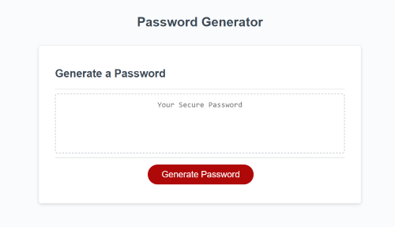

# Cybermaster Security


## User Story

```
AS AN employee working for a cybersecurity firm
I WANT the other employees to have the ability to generate a password
SO THAT the employees can keep their information confidential
```

## Acceptance Criteria

```
GIVEN when Cybermaster Security's employees need a new password
When employees want to generate a new password
They can gain access to a webpage that will allow for this
When employees are generating a password
then the limitation for the password is between 8-128 characters
When employees are generating a password 
then they are mandated to pick at least one uppercase letter
When employees are generating a password
then they are mandated to pick at least one lowercase letter
When employees are generating a password
then they are mandated to pick at least one number
When employees are generating a password 
then they are mandated to pick at least one special character

```

## Image Of Password Generator

The image below represent the webpage for the password generator.



## Credits

Below are links to codes that were used in the JavaScript code.
```
geeksforgeeks.org:
https://www.geeksforgeeks.org/how-to-select-a-random-element-from-array-in-javascript/
```
```
stackoverflow.com:
https://stackoverflow.com/questions/2450954/how-to-randomize-shuffle-a-javascript-array
```
## Collaborator

```
Jason Yang - classmate whom assited in the assignment.
Github account - https://github.com/Jasony95
```